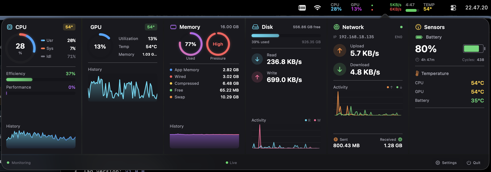

# xStats

<div align="center">


**A beautiful, open-source macOS menu bar system monitor**

[Features](#features) • [Installation](#installation) • [Screenshots](#screenshots) • [Development](#development)

</div>

---

xStats is a native macOS menu bar application that displays real-time system statistics. Built as a free and open-source alternative to iStat Menus, featuring a modern horizontal panel layout with real-time graphs and detailed system metrics.

## ✨ Features

- **Real-time Monitoring**: Track CPU, Memory, Disk, Network, Battery, Temperature, Fan, and GPU stats
- **Beautiful UI**: Modern dark theme with smooth gradients and animations
- **Menu Bar Customization**: Choose what to display and how (icon, percentage, bar, speed, indicator)
- **Horizontal Panel Layout**: All your stats in one clean popover
- **Apple Silicon Optimized**: Native support for M1/M2/M3 chips with GPU monitoring via Metal
- **Lightweight**: Minimal resource footprint, written in pure Swift
- **Privacy-First**: No telemetry, no analytics, no network connections

### Monitored Metrics

| Metric | Details |
|--------|---------|
| **CPU** | Usage per core, user/system breakdown, frequency |
| **Memory** | App/wired/compressed/free breakdown, pressure indicator |
| **Disk** | Usage percentage, read/write I/O speeds |
| **Network** | Upload/download speeds per interface |
| **Battery** | Level, charging status, time remaining, health, cycle count |
| **Temperature** | CPU, GPU, memory, battery sensors |
| **Fan** | Multiple fan speeds with RPM |
| **GPU** | Utilization, VRAM usage, temperature (Apple Silicon) |

## 📸 Screenshots



*Menu bar displaying real-time stats with popover open*

## 📦 Installation

### Download Release

1. Download the latest `xStats-*.dmg` from [Releases](https://github.com/fordewe/xStats/releases)
2. Open the DMG file
3. Drag **xStats** to Applications folder
4. Launch from Applications

**Note**: xStats requires macOS 13.0 (Ventura) or later.

### Build from Source

```bash
# Clone the repository
git clone https://github.com/fordewe/xStats.git
cd xStats

# Build the DMG
./build-dmg.sh

# Or run directly
swift run
```

## 🎮 Usage

### Menu Bar

Click the xStats icon in the menu bar to open the popover. The app displays all your system metrics in a clean horizontal layout.

### Customization

1. Open xStats popover
2. Click the gear icon ⚙️ in the top-right
3. Toggle items on/off
4. Change display styles (icon, percentage, bar, speed, indicator)
5. Drag to reorder items
6. Click outside to close

### Display Styles

| Style | Description | Example |
|-------|-------------|---------|
| **Icon + Text** | Icon with value | `🔵 45%` |
| **Percentage** | Label with value | `CPU`<br>`45%` |
| **Bar** | Label with progress bar | `CPU`<br>`▓▓▓▓░` |
| **Speed** | Network speed (up/down) | `↓1.2MB ↑500KB` |
| **Indicator** | Activity dots (network) | `🔴🟢` |

## 🛠️ Development

### Requirements

- macOS 13.0+ (Ventura or later)
- Xcode 14+ or Swift 5.9+
- Swift Package Manager

### Build

```bash
# Build
swift build

# Run
swift run

# Build release
swift build -c release

# Build DMG
./build-dmg.sh
```

### Project Structure

```
Sources/xStatsMenu/
├── App/                    # Application entry point
├── Models/                 # Data models and settings
├── Services/               # Monitoring services
├── Views/                  # SwiftUI views
│   ├── Panels/            # Stats panels
│   └── Components/        # Reusable UI components
└── Utilities/             # SMC, theme, extensions
```

### Architecture

- **Monitoring Services**: Collect system data using Mach API, IOKit, SMC, and Metal
- **StatsCollector**: Singleton coordinator aggregating data with 60-second history buffers
- **SwiftUI Views**: Reactive UI components displaying real-time metrics
- **Menu Bar Integration**: Custom NSImage rendering for efficient menu bar display

## 🙏 Acknowledgments

- **SMC Implementation**: Based on [Stats](https://github.com/exelban/stats) by exelban
- **Inspired by**: [iStat Menus](https://bjango.com/mac/istatmenus/)
- **Built with**: SwiftUI, Swift Package Manager

## 📄 License

MIT License - see [LICENSE](LICENSE) for details.

## 🤝 Contributing

Contributions are welcome! Please feel free to submit issues or pull requests.

1. Fork the repository
2. Create your feature branch (`git checkout -b feature/amazing-feature`)
3. Commit your changes (`git commit -m 'feat: add amazing feature'`)
4. Push to the branch (`git push origin feature/amazing-feature`)
5. Open a Pull Request

## ⭐ Star History

If you find xStats useful, consider giving it a star!

[](https://star-history.com/#fordewe/xStats&Date)

---

<div align="center">

Made with ❤️ by [@fordewe](https://github.com/fordewe)

[⬆ Back to Top](#xstats)

</div>
